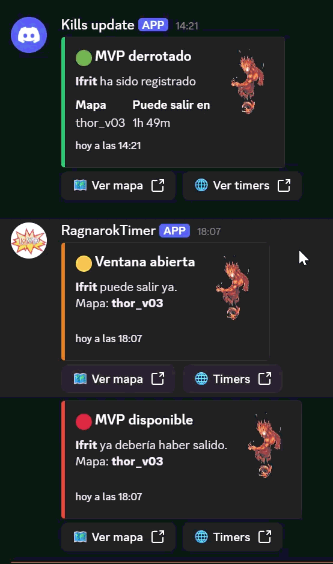

# 🤖 Ragnarok MVP Tracker Bot  
### Real-Time Event Tracking & Discord Notification System

## 📌 Overview

A real-time event tracking and notification system built in Python, designed to help a group of players coordinate MVP boss hunting in Ragnarok Online.

The application tracks boss kills, calculates respawn timers, and sends automated updates to a Discord server, allowing users to monitor boss availability without manual tracking.

---

## 🧠 Features

- ⏱️ Tracks MVP kill timestamps  
- 🔁 Calculates respawn windows automatically  
- 🔔 Sends real-time notifications via Discord bot  
- 🎨 Color-based status system:
  - 🟢 Green → Recently killed (cooldown active)  
  - 🟡 Yellow → Approaching respawn  
  - 🔴 Red → Available to spawn  
- 📍 Stores and tracks tomb locations  
- 👥 Designed for multi-user coordination  

---

## ⚙️ Tech Stack

- Python  
- Discord API (bot)  
- MongoDB  
- Jinja (templating)  

---

## 🧠 System Logic

The system is based on time-driven state transitions:

1. User registers MVP kill  
2. Timestamp is stored in MongoDB  
3. Respawn window is calculated  
4. Status updates over time:
   - Green → Yellow → Red  
5. Discord bot notifies users automatically  
6. Tomb location is tracked to anticipate next spawn  

---

## 🎥 Demo

### Step 1 – Register MVP Kill


---

### Step 2 – Tracking & Status Update


---

### Step 3 – Notification & Coordination


---

## ▶️ How to Run

### 1. Clone the repository

```bash
git clone https://github.com/Granades/ragnarok-mvp-tracker.git
cd ragnarok-mvp-tracker
